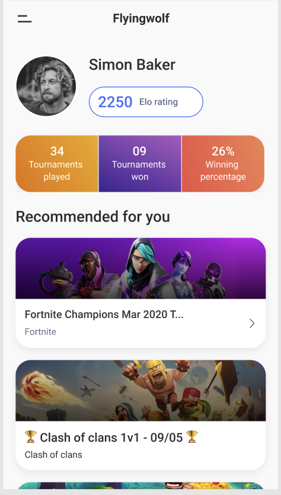

# app-developer-assignment
Assignment for app developers

You need to create a Flutter app containing 2 screen as per specifications given below. Once you are done, please share the following:
1. URL of the source code uploaded to github
2. URL of a “release mode” APK file

Please keep the code as clean and readable as you can.

### Assignment specifications:

**1. Login screen:**

  This will be the first screen.
  a. It will have 4 UI items:
  
    i. An image of game.tv logo
    ii. Username text field: It should have validation of min 3 characters and max 11 with proper error message if the validation fails.
    iii. Password field: It should have validation of min 3 characters and max 11 with proper error message if the validation fails.
    iv. Submit button: It should be disabled if either validation fails.
    
  b. Other points:
  
    i. If a user has already logged in, they should be automatically logged in and sent to the home screen directly next time they open the app.
    ii. You don't need to hit an api to login. Just hardcode a couple of valid username/password pairs and show an error message if the user enters invalid pair.
      User 1: 9898989898 / password123
      User 2: 9876543210 / password123
    iii. Some UI points:
      1. All 4 items should be horizontally and vertically centered both, one below the other
      
**2. Home screen:**
This will hold some information related to the logged in user, along with a few tournament cards. Please follow the design as closely as possible:

  a. API:
  
    i. Hit an API to fetch the data for the User Details section i.e. the UI elements above “Recommended for you” section. You can use any mocking server of your choice to create the API yourself.
    ii. For the “Recommended for you” section, hit the following api:
        http://tournaments-dot-game-tv-prod.uc.r.appspot.com/tournament/api/tournaments_list_v2?limit=10&status=all
    iii. Add loading spinners/error states as necessary.
    iv. Please use a state management library of your choice.
    v. (Bonus for freshers, mandatory for experienced) The api mentioned in point ii (tournaments_list_v2) supports pagination, where you specify how many results you wish to receive using the limit parameter (say 10), then fetch the subsequent 10 items by specifying a cursor param in the subsequent api hit. This cursor param is to be picked from the response of preceding api hit. For example:
      http://tournaments-dot-game-tv-prod.uc.r.appspot.com/tournament/api/tournaments_list_v2?limit=10&status=all&cursor=CmMKGQoMcmVnX2VuZF9kYXRlEgkIgLTH_rqS7AISQmoOc35nYW1lLXR2LXByb2RyMAsSClRvdXJuYW1lbnQiIDIxMDQ5NzU3N2UwOTRmMTU4MWExMDUzODEwMDE3NWYyDBgAIAE=
      The relevant data points from the above are: name, cover_url, game_name. Please implement infinite scroll for the above api
   
   b. Please make the whole page scrollable including the header. 
    
### Bonus Points:
1. Add support for localization in the app for English and Japanese.
2. Build an API for the User Details section instead of mocking it.
